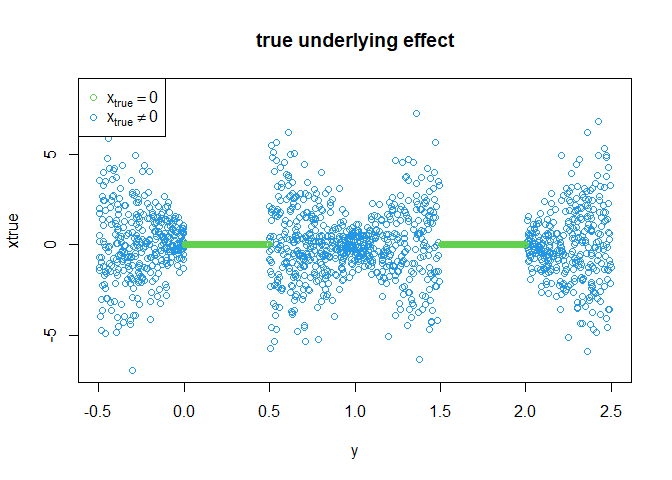
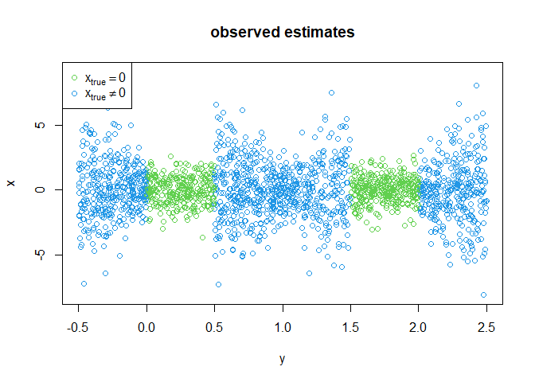
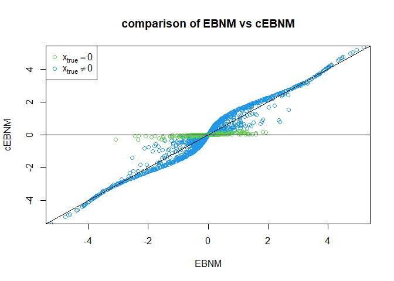
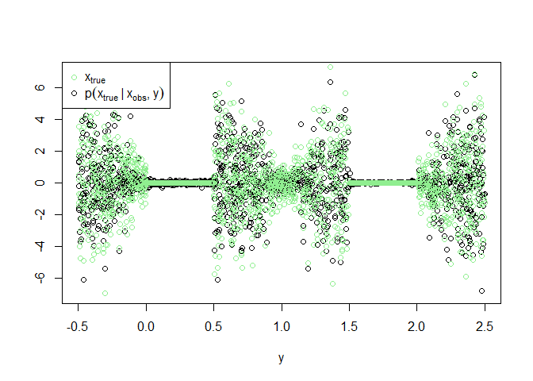
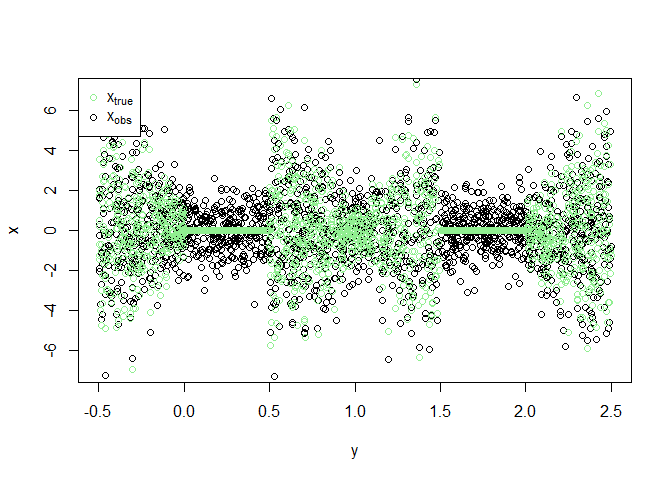

comoR: covariate moderated Empirical Bayes matrix factorization methods
================
William R.P. Denault
2024-05-15

## Installation

``` r
devtools::install_github('william-denault/comoR')
```

## Usage

comoR has two main functions: cEBMF and como. cEBMF is a function that
performs covariate moderated Empirical Bayes matrix factorization using
TensorFlow models. As described in our manuscript, we fit the cEBMF
model by solving a sequence of simpler problems referred to as the
covariate moderated Empirical Bayes normal mean (cEBNM) problem. The
como function solves the covariate moderated Empirical Bayes normal mean
(cEBNM) problem for various parametrizations of the problem, and it can
easily be interfaced with the flashier package to perform cEBMF using
the flashier framework. Below we show how to use the como function to
fit a cEBNM model using a mixture of normal prior and a neural net.

We showcase different cEBNM solvers (mixture of normal and mixture
exponential) in the vignette ’custom cEBNM with TensorFlow” and
“covariate moderated exponential mixture.” When no covariates are
available, we fit the Empirical Bayes normal mean (EBNM) problem by
fitting a mixture model. We show how to solve efficiently the EBNM
problem in the vignette “fitting a mixture of exponential using mix
SQP”. This vignette showcases how to fit a mixture of exponential prior
using mixsqp a sequential quadratic programming method for fast
maximum-likelihood estimation.

## cEBNM solver

### Simulate data

We start by simulating some data in which the distribution of the true
underlying $x_{true}$ stems from a distribution that depends on a single
covariate $y$. Unfortunately, we only observe the noisy version of
$x_{true}$, $x_{obs}$, and we want to estimate $x_{true}$ from $x_{obs}$
while leveraging the information $y$.

``` r
set.seed(1)
y <-runif(2000,min=-0.5, max=2.5)
X = cbind(y)
xtrue = 0*y
for (i in 1:length(xtrue)){

  if ( (    y[i] <.5 & y[i] >.0 ) | (y[i] >1.5 & y[i] <2) ){
    xtrue[i] = 0
  }else{
    xtrue[i]= rnorm(1,sd=0.5+ 2*abs(sin( pi*y[i])))
  }


}

x = xtrue + rnorm(length(xtrue), sd=1)
s= rep(1,length(x))
Z <- matrix( 1, nrow=length(x), ncol=1)
plot (y,xtrue, main="true underlying effect",
       col =ifelse(xtrue==0, 3,4))
legend('topleft',c( expression(x[true] == 0) ,expression(x[true] != 0)),col=c(3,4),pch=1)
```

<!-- -->

``` r
plot (y,x, main="observed estimates",
       col =ifelse(xtrue==0, 3,4))
legend('topleft',c( expression(x[true] == 0) ,expression(x[true] != 0)),col=c(3,4),pch=1)
```

<!-- -->

### Prepare como object

We start by defining the como parameters. Here, we fit the cEBNM model
using a mixture of normal parametrized by a neural net.

``` r
param_como = list(max_class= 10,
                  mnreg_type="keras",
                  prior ='mix_norm'# "mix_exp"
                  )
data <- comoR:::como_prep_data (betahat=x,
                                 se=s, X=X,
                                 Z =Z )
```

Let’s define the neural net architecture using TensorFlow.

``` r
num_classes <- length( autoselect_scales_mix_exp(data$betahat, data$se,10))

#define the nnet paramet using Keras syntax
param_nnet =keras_model_sequential() %>%
  layer_dense(units = 64,
              activation = 'relu',
              input_shape = c(1)) %>%
  layer_dense(units = 64,
              activation = 'relu' ) %>% 
  layer_dense(units = 32,
              activation = 'relu' ) %>%
  layer_dense(units = 16,
              activation = 'relu' ) %>%
  layer_dense(units = num_classes,#important to have the same number of units as the number of classes
              activation = 'softmax')
```

### Fit model

Here we fit the model

``` r
fit_como  <- rlang::exec( "data_initialize_como", !!! param_como ,
                          data= data,
                          param_nnet= param_nnet) # initialize the model from the data
fit =fit_como

 

fit_como <- comoR:::fit.como ( fit_como, data, max_iter = 40 )
fit =fit_como
```

## Check performances

First, let’s have a look if adding some information helps in computing
the posterior mean of the true underlying effect $x_{true}$. We compare
the posterior mean of cEBNM and EBNM (no covariate).

``` r
est <- comoR:::post_mean_sd (fit,data)
  

ash_res <- ashr::ash(x, s )

 

plot(x=ash_res$result$PosteriorMean,
     y=est$mean,  
     col =ifelse(xtrue==0, 3,4),
     main='comparison of EBNM vs cEBNM',xlab='EBNM',ylab='cEBNM',
     xlim=c(-5,5),ylim=c(-5,5))
legend('topleft',c( expression(x[true] == 0) ,expression(x[true] != 0)),col=c(3,4),pch=1)

abline(h=0)
abline(a=0,b=1)
```

<!-- -->

Let’s now have a look at the posterior mean of $x_{true}$ given
$x_{obs}$ and $y$, compared to the noisy observation $x_{obs}$.

``` r
plot(y,est$mean ,ylab="" ,ylim=c(-7,7))
points(y,xtrue, col='lightgreen')
legend('topleft', 
       legend = c(expression(x[true]  ), expression(p(x[true] ~ "|" ~ x[obs] * "," ~ y))), 
       col = c('lightgreen', 'black'), 
       pch = 1)
```

<!-- -->

Here the data we observed compared to the true underlying effect
$x_{true}$.

``` r
plot(y,x , ylim=c(-7,7))
points(y,xtrue, col='lightgreen')
legend('topleft',c( expression(x[true] ) ,expression(x[obs]  )),col=c('lightgreen',"black"),pch=1)
```

<!-- -->
